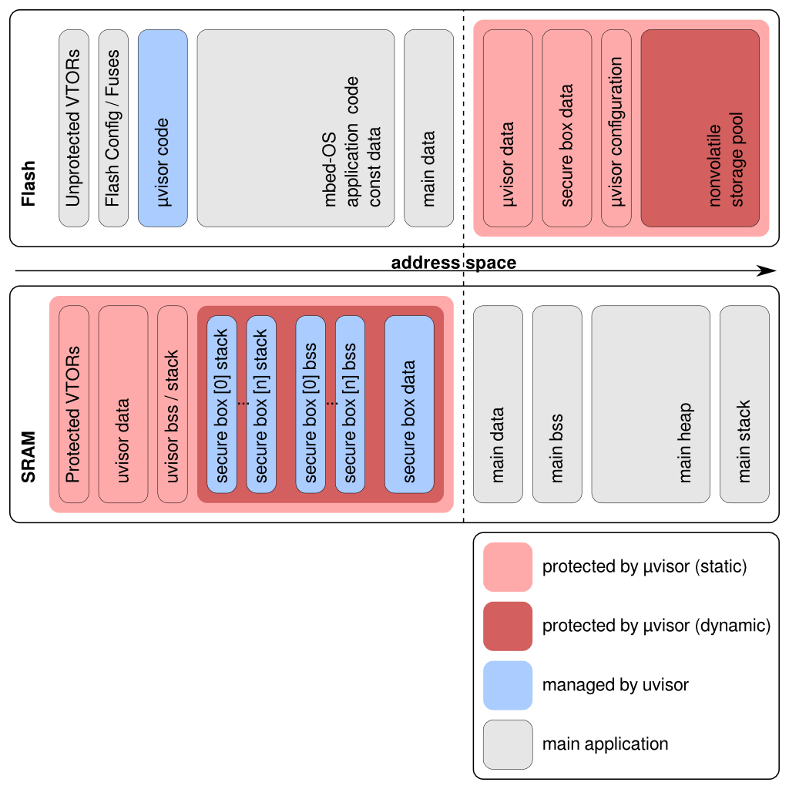

# The uVisor

## Overview

The uVisor is a self-contained software hypervisor that creates independent secure domains on ARM Cortex-M3 and M4 microcontrollers (M0+ will follow). Its function is to increase resilience against malware and to protect secrets from leaking even among different modules of the same application.

Further reading:
- The uVisor [Design Philosophy](#the-uvisor-design-philosophy)
  - [Techical Details](#technical-details)
  - [Memory Layout](#memory-layout)
  - [Secure Boot](#the-boot-process)
- uVisor-lib user mode APIs
  - [API documentation](https://github.com/ARMmbed/uvisor-lib/blob/master/DOCUMENTATION.md)
  - [yotta module](#the-uvisor-as-a-yotta-module) integration
- [Secure coding guidelines](SECURE-CODING.md) for code contributors

### Word of caution
This version of the uVisor is an early beta with an **incomplete implementation of the security features** of the final product. Future versions of uVisor will add these functions - starting with this year's ARM TechCon that will come with a security challenge firmware.

Some of the open uVisor issues in progress are listed here:
- [list of open issues](https://github.com/ARMmbed/uvisor/issues)
- [FIXMEs](https://github.com/ARMmbed/uvisor/search?utf8=%E2%9C%93&q=FIXME)

### Supported platforms:
- [Freescale FRDM-K64F](http://developer.mbed.org/platforms/FRDM-K64F/) ([GCC ARM Embedded toolchain](https://launchpad.net/gcc-arm-embedded)).
- [STMicorelectronics STM32F429I-DISCO](http://www.st.com/web/catalog/tools/FM116/SC959/SS1532/PF259090) ([GCC ARM Embedded toolchain](https://launchpad.net/gcc-arm-embedded)).

## The uVisor Design Philosophy

The need for security features applies across a wide range of today’s IoT products. We at ARM are convinced that many IoT security problems can be solved with standardised building blocks.

The uVisor project is one of these basic building blocks – complementary to other important blocks like robust communication stacks, safe firmware updates and secure crypto libraries.

The design philosophy of uVisor is to provide hardware-enforced compartments (sandboxes) for individual code blocks by limiting access to memories and peripherals using the existing hardware security features of the Cortex-M microcontrollers.

Breaking the established flat security model of microcontrollers into compartmentalised building blocks results in high security levels, as the reach of flaws or external attacks can be limited to less sensitive function blocks.

A basic example of uVisor is preventing unauthorised access to flash memory from faulty or compromised code. This not only prevents malware from getting resident on the device, but also enables protection of device secrets like cryptographic keys.

Services built on top of our security layer can safely depend on an unclonable trusted identity, secure access to internet services and benefit from encryption key protection.

## Technical Details

The uVisor:

* Is initialised right after device start-up.
* Runs in privileged mode.
* Sets up a protected environment using a Memory Protection Unit (the ARM Cortex-M MPU or a vendor-specific alternative). In particular:
    * Its own memories and the security-critical peripherals are protected from the unprivileged code.
    * Unprivileged access to selected hardware peripherals and memories is limited through Access Control Lists (ACLs).
* Allows interaction from the unprivileged code by exposing SVCall-based APIs.
* Forwards and de-privileges interrupts to the unprivileged code that has been registered for them.
* Prevents registers leakage when switching execution between privileged and unprivileged code and between mutually untrusted unprivileged modules.
* Forces access to some security-critical peripherals (like DMA) through SVCall-based APIs.

### The Unprivileged Code

All the code that is not explicitly part of the uVisor is generally referred to as unprivileged code. The unprivileged code:

* Runs in unprivileged mode.
* Has direct memory access to unprivileged peripherals.
* Can register for unprivileged interrupts.
* The uVisor prevents its access to privileged memories and peripherals.

The unprivileged code can be made of mutually untrusted isolated modules (or boxes). This way, even if all are running with unprivileged permissions, different modules can protect their own secrets and execute critical code securely.

### Memory Layout

The following figure shows the memory layout of a system where security is enforced by the uVisor.



The uVisor secures two main memory blocks, in Flash and SRAM respectively. In both cases, the uVisor protects its own data and the data of the secure boxes it manages for the unprivileged code. In general, all the unprivileged code that is not protected in a secure domain is referred to as "main application".

The main memory sections that the uVisor protects are detailed in the following table:

<table>
  <tbody>
    <tr>
      <th>Memory Section</th>
      <th>Description</th>
    </tr>
    <tr>
      <td>uVisor code</td>
      <td>The uVisor code is readable and executable by unprivileged code, so that code sharing is facilitated and privileged-unprivileged transitions are easier
      </td>
    </tr>
    <tr>
      <td>uVisor data/BSS/stack</td>
      <td>The uVisor places all its constants, initialised and initialised data and the stack in secured areas of memory, separated from the unprivileged code
      </td>
    </tr>
    <tr>
      <td>Secure boxes data/BSS/stack</td>
      <td>Through a configuration process, unprivileged code can set up a secure box for which data and stack can be secured by the uVisor and placed in isolated and protected memory areas
      </td>
    </tr>
    <tr>
      <td>Protected VTORs</td>
      <td>Interrupt vectors are relocated to the SRAM but protected by the uVisor. Access to them is made through specific APIs
      </td>
    </tr>
  </tbody>
</table>

### The Boot Process

The uVisor is initialised right after device startup and takes ownership of its most critical assets, like privileged peripherals, the vector table and memory management. In particular:

1. Several sanity checks are performed, to verify integrity of the memory structure as expected by the uVisor.
2. The `bss` section is zeroed, the `data` section initialised (uVisor).
3. The vector table is relocated.
4. The virtual Memory Protection Unit (vMPU) is initialised:
    * Secure boxes are loaded:
        * The `bss` section is zeroed, the `data` section initialised (secure boxes).
        * Access Control Lists (ACLs) are registered for each secure box.
        * Stacks are initialised for each secure box.
    * The MPU (ARM or third-party) is configured.
5. Privileged and unprivileged stack pointers are initialised.
6. Execution is de-privileged and handed over to the unprivileged code.

## The uVisor as a yotta Module

The uVisor is compiled and packaged to be included as a dependency by applications built with yotta on top of mbed. The yotta module for the uVisor is called [**uvisor-lib**](https://github.com/ARMmbed/uvisor-lib-private).

When used as a yotta module on top of mbed, the uVisor comes as a pre-compiled binary blob that is then included in the rest of the system. In this way the integrity of the uVisor, and hence its security model, are guaranteed. Each official release of uvisor-lib will then deliver an approved build of the code tree here presented, also exposing the APIs for the unprivileged application.

We suggest you always use the official uvisor-lib module through the regular yotta build process. For development, experimenting, or fun, the uVisor can also be manually turned into a yotta module and locally linked to your project. First of all, build the yotta module:

```bash
# select the correct platform in the code tree
cd k64f/uvisor

# build the uVisor and generate the yotta module
make clean release
```
Then link your local version of the module to yotta:
```bash
# the release folder is at the top level of the code tree
cd ../../release

# link the module to yotta locally
yotta link

# link your project to this version of uvisor-lib
cd ../your_custom_project
yotta link uvisor-lib
```

Again, consider using the official uvisor-lib release if building with yotta, and refer to its [documentation](https://github.com/ARMmbed/uvisor-lib-private) for the APIs it exposes to unprivileged code.

## Debugging

By default, debug output is silenced. Special debug messages only occur when the device is halted due to faults or failures caught by the uVisor. These messages are tentatively printed on the UART0 port, if it has previously been enabled by the unprivileged code. Otherwise, SWO is used as a fallback.

To enable more verbose debug messages, just build as follows:

```bash
# create local version of uvisor-lib with debug enabled
make OPT= clean release
```
And locally link the resulting debug release to yotta as described previously.

Note that this debug build implements non-blocking messages. If an SWO viewer is not used, messages are just lost and executions continues normally. If the uVisor caught an error or an access fault, though, the system is halted.

Debugging messages that are outputted through the SWO port can be observed with an SWO viewer. If using a JLink debugger, just do as follows:

```bash
cd k64f/uvisor
make swo
```

Or refer to `Makefile.rules` to import the `swo` rule in your build
environment.

## Software and Hardware Requirements

* One of the available target boards:
 * [Freescale FRDM-K64F](http://developer.mbed.org/platforms/FRDM-K64F/)
 * [STMicorelectronics STM32F429I-DISCO](http://www.st.com/web/catalog/tools/FM116/SC959/SS1532/PF259090)

To build:

* Latest [GCC ARM Embeeded toolchain](https://launchpad.net/gcc-arm-embedded).

To debug:

* A JLink debugger (JLink LITE CortexM at least).
* Latest [SEGGER JLink software & documentation  pack](https://www.segger.com/jlink-software.html) for the target platform.
