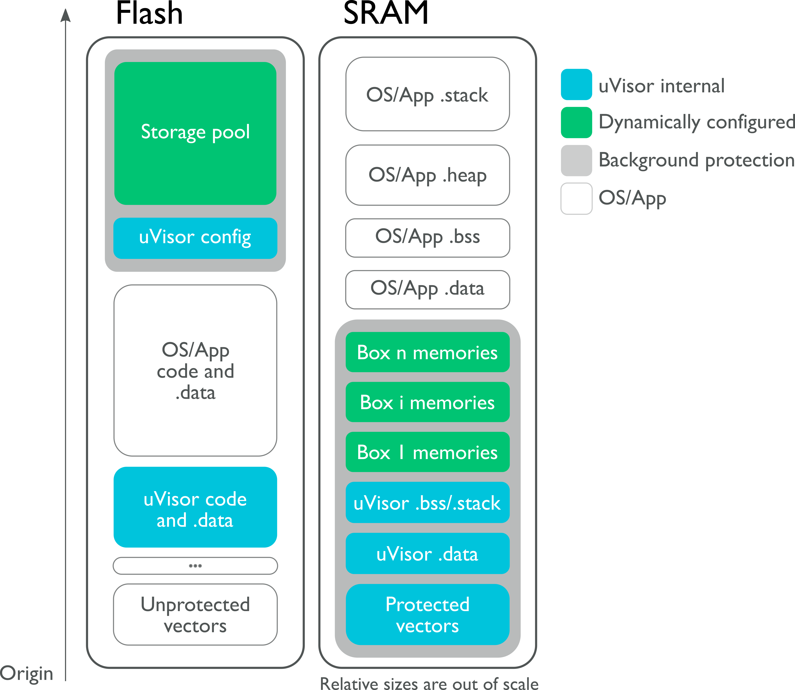

# Technical Details

The uVisor is initialized right after device reset. For allowing application of System-On-Chip (SoC) specific quirks or clock initialization a the SystemInit hook is available for early hardware clock initialization.
After initializing the *A*ccess *C*ontrol *L*ists (ACL's) for each individual security domain (process) the uVisor sets up a protected environment using a Memory Protection Unit (the ARM Cortex-M MPU or a vendor-specific alternative).

After initializing itself, the uVisor turns the memory protection turned on, drops execution to unprivileged mode and starts the operating system initialization and continues the boot process.

In case of privileged interrupts, uVisor forwards and de-privileges them and passes execution to the unprivileged operating system or applications interrupt handler.
To protect from information leakage between mutually distrustful security domains, uVisor saves and clears all relevant CPU core registers when interrupting one security context by another   registers leakage when switching execution between privileged and unprivileged code and between mutually untrusted unprivileged modules.

Memory access via DMA engines can potentially bypass uVisor security policies - therefore access to security-critical peripherals (like DMA) need to be restricted to permitted memory ranges by SVCall-based APIs.

## Memory Layout and Management

Different memory layouts can be used on different platforms, depending on the implemented memory protection scheme and on the MPU architecture. The following figure shows the memory layout of a system where the uVisor shares the SRAM module with the operating system (ARMv7-M MPU).

uVisor provides only methods for allocating and de-allocating large blocks of uniformely sized memory to avoid fragmentation (for example: 4kb chunk size on a 64kb sized SRAM).

Each process gets at compile-time a fixed memory pool assigned which will be used for heap, stack, thread-local storage and messaging.

{ width=15cm }

The uVisor secures two main memory blocks, in flash and SRAM respectively. In both cases, it protects its own data and the data of the secure boxes it manages for the unprivileged code.

All the unprivileged code that is not protected in a secure domain is referred to as the *main process*.

The main memory sections protected by uVisor are detailed in the following table:

------------------------------------------------------------------------
**Memory section**          **Description**
--------------------------- --------------------------------------------
uVisor code                 The uVisor code is readable and executable
                            by unprivileged code, so that code sharing
                            is facilitated and privileged-unprivileged
                            transitions are easier.

uVisor data/BSS/stack       The uVisor places all its constants,
                            initialized and uninitialized data and the
                            stack in secured areas of memory, separated
                            from the unprivileged code.

Secure boxes data/BSS/stack Through a configuration process,
                            unprivileged code can set up a secure
                            process for which data and stack can be
                            secured by the uVisor and placed in
                            isolated and protected memory areas.

Vector table                Interrupt vectors are relocated to the SRAM
                            but protected by the uVisor. Access to IRQs
                            is made through specific APIs.
------------------------------------------------------------------------
